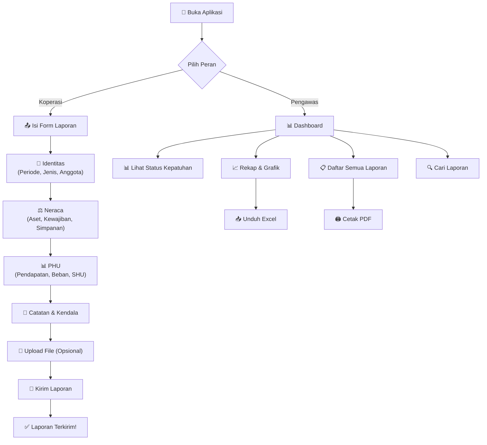

# 📖 Panduan Penggunaan KMP Pattimura

> **Versi:** 1.0 · **Terakhir diperbarui:** Juni 2026  
> Platform Pelaporan Keuangan Koperasi Desa Merah Putih — Kepulauan Maluku

---

## Daftar Isi

1. [Apa itu KMP Pattimura?](#1-apa-itu-kmp-pattimura)
2. [Cara Mengakses Aplikasi](#2-cara-mengakses-aplikasi)
3. [Login — Masuk ke Sistem](#3-login--masuk-ke-sistem)
4. [Portal Koperasi (Pelaporan)](#4-portal-koperasi-pelaporan)
5. [Portal Pengawas (Monitoring)](#5-portal-pengawas-monitoring)
6. [Fitur Tambahan](#6-fitur-tambahan)
7. [FAQ & Troubleshooting](#7-faq--troubleshooting)

---

## 1. Apa itu KMP Pattimura?

**KMP Pattimura** adalah aplikasi web untuk pelaporan keuangan **Koperasi Desa Merah Putih** di seluruh wilayah Kepulauan Maluku. Aplikasi ini menggantikan sistem pelaporan via WhatsApp sebelumnya.

### Siapa yang menggunakan?

| Peran | Pengguna | Fungsi |
|-------|----------|--------|
| **Koperasi** | Pengurus cabang koperasi (7 cabang) | Mengirim laporan keuangan berkala |
| **Pengawas** | Supervisor pusat | Memantau & menganalisis semua laporan |

### 7 Cabang Koperasi

| No | Nama Cabang | Wilayah | Kepulauan |
|----|-------------|---------|-----------|
| 1 | KMP-Ambon | Kota Ambon | Kepulauan Ambon |
| 2 | KMP-Seram | Maluku Tengah | Kepulauan Seram |
| 3 | KMP-Buru | Kabupaten Buru | Kepulauan Buru |
| 4 | KMP-Kei | Maluku Tenggara | Kepulauan Kei |
| 5 | KMP-Tanimbar | Kepulauan Tanimbar | Kepulauan Tanimbar |
| 6 | KMP-Aru | Kepulauan Aru | Kepulauan Aru |
| 7 | KMP-Babar | Maluku Barat Daya | Kepulauan Babar |

---

## 2. Cara Mengakses Aplikasi

### Dari HP (Smartphone)
1. Buka browser (Chrome, Safari, atau browser apapun)
2. Ketik alamat: **`silapor-pattimura-xxx.vercel.app`** (cek link terbaru dari admin)
3. Aplikasi langsung terbuka, tidak perlu install apapun

### Dari Laptop/PC
1. Buka browser apapun
2. Buka URL yang sama seperti di atas

> [!TIP]
> **Simpan di Home Screen HP:** Di Chrome, ketuk ⋮ → *"Add to Home Screen"* agar bisa buka seperti aplikasi biasa tanpa ketik URL lagi.

---

## 3. Login — Masuk ke Sistem

Saat pertama kali membuka aplikasi, kamu akan melihat halaman login berwarna hitam dengan logo **KMP Pattimura**.

### 3.1 Login sebagai Koperasi

```
Langkah:
1. Pilih "Masuk sebagai" → Koperasi
2. Pilih nama koperasimu dari dropdown
3. Masukkan password koperasi
4. Klik tombol "Masuk →"
```

**Daftar Password Koperasi:**

| Koperasi | Password |
|----------|----------|
| KMP-Ambon | `kmpambon` |
| KMP-Seram | `kmpseram` |
| KMP-Buru | `kmpburu` |
| KMP-Kei | `kmpkei` |
| KMP-Tanimbar | `kmptanimbar` |
| KMP-Aru | `kmparu` |
| KMP-Babar | `kmpbabar` |

### 3.2 Login sebagai Pengawas

```
Langkah:
1. Pilih "Masuk sebagai" → Pengawas
2. Masukkan password: pengawas123
3. Klik tombol "Masuk →"
```

> [!NOTE]
> **Session tersimpan otomatis.** Selama kamu tidak menekan tombol logout (↩), kamu tetap login meskipun menutup browser. Sesi akan pulih saat membuka kembali.

### 3.3 Logout (Keluar)

Klik tombol **↩** (panah) di pojok kanan atas layar. Kamu akan kembali ke halaman login.

---

## 4. Portal Koperasi (Pelaporan)

Setelah login sebagai koperasi, kamu akan melihat 2 tab:

```
📤 Kirim Laporan    |    📋 Riwayat
```

---

### 4.1 📤 Kirim Laporan — Mengisi & Mengirim Laporan Keuangan

Form laporan terdiri dari **5 bagian** (scroll ke bawah untuk melihat semua):

---

#### Bagian 1: 📌 Identitas Laporan

| Field | Penjelasan | Contoh |
|-------|-----------|--------|
| **Periode** | Bulan laporan yang dilaporkan | `Mei 2025` |
| **Jenis Laporan** | Bulanan, Triwulan, atau Tahunan | `Bulanan` |
| **Jumlah Anggota Aktif** | Total anggota koperasi saat ini | `120` |

---

#### Bagian 2: ⚖️ Neraca (Posisi Keuangan)

Bagian ini melaporkan kondisi aset, utang, dan modal koperasi.

##### Aset (Harta Koperasi)

| Field | Penjelasan | Cara Isi |
|-------|-----------|----------|
| **Total Aset (Rp)** | Jumlah seluruh harta koperasi | Masukkan angka tanpa titik, contoh: `450000000` |
| **Kas & Bank (Rp)** | Uang tunai + saldo di rekening bank | Contoh: `100000000` |
| **Piutang Anggota (Rp)** | Uang pinjaman yang belum dikembalikan anggota | Contoh: `80000000` |
| **Pinjaman Disalurkan (Rp)** | Total pinjaman yang sudah diberikan ke anggota | Contoh: `150000000` |

##### Kewajiban & Ekuitas

| Field | Penjelasan |
|-------|-----------|
| **Total Kewajiban / Utang (Rp)** | Utang koperasi ke pihak luar (bank, dll) |
| **Dana Cadangan & Hibah (Rp)** | Dana cadangan + hibah yang diterima |

##### Simpanan Anggota

| Field | Penjelasan |
|-------|-----------|
| **Simpanan Pokok (Rp)** | Dibayar sekali saat jadi anggota, tidak bisa ditarik |
| **Simpanan Wajib (Rp)** | Dibayar rutin tiap bulan, tidak bisa ditarik |
| **Simpanan Sukarela (Rp)** | Tabungan anggota yang bisa ditarik kapan saja |

> [!IMPORTANT]
> **Cek Neraca Seimbang!** Setelah mengisi semua kolom neraca, sistem akan otomatis menghitung apakah neraca sudah balance:
> - ✅ **Hijau** = Neraca seimbang (Aktiva = Pasiva) → Benar!
> - ⚠️ **Merah** = Neraca belum seimbang → Cek ulang angka-angka yang diisi
>
> **Rumus:** Total Aset = Total Kewajiban + Simpanan Pokok + Simpanan Wajib + Simpanan Sukarela + Dana Cadangan & Hibah

---

#### Bagian 3: 📊 Perhitungan Hasil Usaha (PHU)

Bagian ini melaporkan pendapatan dan pengeluaran koperasi.

##### Pendapatan (Pemasukan)

| Field | Penjelasan |
|-------|-----------|
| **Jasa Pinjaman / Bunga (Rp)** | Pendapatan bunga dari pinjaman anggota |
| **Provisi & Administrasi (Rp)** | Biaya admin yang dipungut dari anggota |
| **Usaha Toko / Lainnya (Rp)** | Pendapatan dari usaha toko atau unit usaha lain |
| **Total Pemasukan (Rp)** | ⚡ *Otomatis dihitung* — tidak perlu diisi |

##### Beban (Pengeluaran)

| Field | Penjelasan |
|-------|-----------|
| **Beban Jasa Simpanan (Rp)** | Bunga/jasa yang dibayar ke anggota atas simpanannya |
| **Beban Operasional (Rp)** | Gaji karyawan, listrik, sewa, ATK, dll |
| **Beban RAT & Koperasi (Rp)** | Biaya rapat anggota, pelatihan, iuran koperasi |
| **Total Pengeluaran (Rp)** | ⚡ *Otomatis dihitung* — tidak perlu diisi |

##### Hasil Akhir

| Field | Penjelasan |
|-------|-----------|
| **SHU Periode Ini (Rp)** | ⚡ *Otomatis dihitung* = Total Pemasukan − Total Pengeluaran |

> [!TIP]
> **Field yang bertanda ⚡ (abu-abu) tidak perlu diisi manual.** Sistem menghitung otomatis saat kamu mengisi field pendapatan dan beban di atasnya.

---

#### Bagian 4: 📝 Catatan & Rencana

| Field | Penjelasan | Contoh |
|-------|-----------|--------|
| **Kendala yang Dihadapi** | Masalah/hambatan operasional | *"Keterlambatan cicilan dari beberapa anggota"* |
| **Rencana Tindak Lanjut** | Langkah yang akan diambil | *"Pendekatan personal ke anggota yang menunggak"* |
| **Catatan Tambahan** | Info lain untuk pengawas | *"Simpanan meningkat 5% bulan ini"* |

---

#### Bagian 5: 📎 Lampiran File (Opsional)

Kamu bisa mengupload dokumen pendukung:

```
Langkah Upload File:
1. Klik area "Ketuk untuk upload file"
2. Pilih file dari HP/komputer
3. Format yang diterima: PDF (.pdf) dan Excel (.xlsx, .xls)
4. File yang dipilih akan muncul di bawah area upload
5. Klik ✕ jika ingin menghapus file yang sudah dipilih
```

> [!NOTE]
> Upload file bersifat **opsional**. Laporan tetap bisa dikirim tanpa lampiran.

---

#### Mengirim Laporan

```
Langkah:
1. Pastikan semua data sudah diisi dengan benar
2. Cek neraca sudah seimbang (badge hijau ✓)
3. Klik tombol merah "📤 Kirim Laporan ke Pengawas" di paling bawah
4. Tunggu proses pengiriman (tombol berubah "Mengirim...")
5. Muncul notifikasi "✓ Laporan berhasil dikirim ke pengawas!"
6. Form otomatis dikosongkan untuk laporan berikutnya
```

> [!WARNING]
> Minimal isi salah satu dari: **Pemasukan**, **Jumlah Anggota**, atau **Catatan** agar laporan bisa dikirim.

---

### 4.2 📋 Riwayat — Melihat Laporan yang Sudah Terkirim

```
Langkah:
1. Klik tab "📋 Riwayat"
2. Semua laporan yang pernah kamu kirim akan muncul
3. Klik salah satu laporan untuk melihat detail lengkap
```

Setiap laporan menampilkan:
- Jenis & Periode laporan
- Pemasukan dan SHU
- Nama file lampiran (jika ada)
- Badge hijau **✓ Terkirim**
- Waktu pengiriman

---

## 5. Portal Pengawas (Monitoring)

Setelah login sebagai pengawas, kamu memiliki **4 tab**:

```
📊 Dashboard    |    📈 Rekap    |    📋 Laporan    |    🔍 Cari
```

---

### 5.1 📊 Dashboard — Status Kepatuhan Koperasi

Dashboard menampilkan ringkasan status pelaporan per periode.

#### Yang Ditampilkan:

| Komponen | Penjelasan |
|----------|-----------|
| **Progress Bar Kepatuhan** | Persentase koperasi yang sudah lapor periode ini |
| **Total Koperasi** | Jumlah semua cabang (7) |
| **Sudah Lapor** | Jumlah koperasi yang sudah kirim laporan |
| **Belum Lapor** | Jumlah koperasi yang belum kirim laporan |
| **Total Anggota** | Jumlah anggota dari koperasi yang sudah lapor |
| **Status per Kepulauan** | Daftar setiap koperasi, dikelompokkan per wilayah |

#### Filter Periode:

```
Langkah:
1. Pilih periode di dropdown kanan atas (contoh: "Mei 2025")
2. Dashboard otomatis update sesuai periode yang dipilih
```

#### Pengelompokan Wilayah:

Koperasi dikelompokkan menjadi 3 gugusan:
- 📍 **Gugusan Ambon & Seram** (Utara & Tengah) — KMP-Ambon, KMP-Seram
- 📍 **Gugusan Kei & Aru** (Tenggara) — KMP-Kei, KMP-Aru
- 📍 **Gugusan Buru, Tanimbar, Babar** (Selatan & Barat Daya) — KMP-Buru, KMP-Tanimbar, KMP-Babar

#### Melihat Detail Koperasi:

```
Langkah:
1. Klik nama koperasi manapun di daftar
2. Modal/popup akan muncul dari bawah
3. Tampil ringkasan: total laporan, pemasukan, SHU, aset, anggota, kendala
4. Di bagian bawah ada "Riwayat Laporan" — klik salah satu untuk lihat detail lengkap
5. Klik "Tutup" atau area gelap di belakang untuk menutup
```

---

### 5.2 📈 Rekap — Analisis Agregat & Grafik

Tab Rekap menampilkan rekapitulasi total keuangan seluruh koperasi.

#### Filter Data:

| Filter | Pilihan |
|--------|---------|
| **Periode** | Semua Periode / Mei 2025 / April 2025 / dll |
| **Kepulauan** | Semua Kepulauan / per Kepulauan |

```
Langkah Filter:
1. Pilih periode dari dropdown "Filter Periode"
2. Pilih kepulauan dari dropdown "Filter Kepulauan"
3. Data otomatis berubah sesuai filter
```

#### Kartu Rekap Utama (area hitam):

| Data | Penjelasan |
|------|-----------|
| **Total Pemasukan** | Angka besar di atas — total pemasukan semua koperasi |
| **Total Pengeluaran** | Total biaya operasional semua koperasi (merah) |
| **Total SHU** | Total laba bersih semua koperasi (hijau) |
| **Total Aset** | Total harta semua koperasi |
| **Total Simpanan** | Total simpanan (pokok + wajib + sukarela) |
| **Total Anggota** | Jumlah anggota dari semua koperasi |
| **Rata-rata/Koperasi** | Rata-rata pemasukan per koperasi |

#### Grafik Batang:

1. **📊 Pemasukan per Kepulauan** — Perbandingan pemasukan antar koperasi
2. **💰 SHU per Kepulauan** — Perbandingan SHU antar koperasi (batang hijau)

#### 🏆 Ranking Koperasi:

Koperasi diurutkan dari yang paling tinggi pemasukannya:
- 🥇 Peringkat 1
- 🥈 Peringkat 2
- 🥉 Peringkat 3
- dst.

#### Tombol Aksi:

| Tombol | Fungsi |
|--------|--------|
| **📥 Unduh Rekap (Excel)** | Download data rekap dalam format CSV/Excel |
| **ℹ️ Bantuan Istilah** | Buka kamus istilah keuangan koperasi |

---

### 5.3 📋 Laporan — Daftar Semua Laporan Masuk

```
Langkah:
1. Klik tab "📋 Laporan"
2. Semua laporan dari semua koperasi akan muncul, diurutkan dari yang terbaru
3. Klik salah satu laporan untuk melihat detail lengkap
```

Setiap item menampilkan:
- Nama Koperasi & Kepulauan
- Periode & Jenis laporan
- SHU
- Ikon 📎 jika ada lampiran file
- Waktu masuk

---

### 5.4 🔍 Cari — Pencarian Laporan

Cari laporan berdasarkan kata kunci apapun.

```
Langkah:
1. Klik tab "🔍 Cari"
2. Ketik kata kunci di kolom pencarian (contoh: "Ambon", "kendala", "Mei")
3. Hasil pencarian muncul secara otomatis saat mengetik (real-time)
4. Gunakan dropdown filter untuk mempersempit pencarian
```

#### Filter Pencarian:

| Filter | Mencari di Field |
|--------|-----------------|
| **Semua** | Semua kolom sekaligus |
| **Koperasi** | Nama koperasi saja |
| **Periode** | Periode laporan saja |
| **Kepulauan** | Nama kepulauan saja |
| **Kendala** | Kolom kendala saja |
| **Catatan** | Kolom catatan saja |

> [!TIP]
> Kata kunci yang cocok akan di-**highlight kuning** di hasil pencarian supaya mudah ditemukan.

---

## 6. Fitur Tambahan

### 6.1 🖨️ Cetak Laporan ke PDF

```
Langkah:
1. Buka detail laporan (klik laporan manapun)
2. Klik tombol biru "🖨️ Cetak PDF" di bawah detail
3. Akan muncul dialog print dari browser
4. Pilih "Save as PDF" atau langsung print ke printer
5. Klik Print/Save
```

> [!TIP]
> Di HP, pilih printer → **"Save as PDF"** → lalu klik download.

---

### 6.2 📥 Download Rekap ke Excel

```
Langkah:
1. Masuk ke tab "📈 Rekap"
2. Atur filter periode dan kepulauan sesuai kebutuhan
3. Klik tombol hijau "📥 Unduh Rekap (Excel)"
4. File CSV akan terdownload otomatis
5. Buka file dengan Microsoft Excel atau Google Sheets
```

File CSV berisi kolom:
- Nama Koperasi, Pulau, Periode, Jenis
- Semua data Neraca (Aset, Kewajiban, Simpanan)
- Semua data PHU (Pemasukan, Pengeluaran, SHU)
- Jumlah Anggota, Kendala, Rencana Tindak Lanjut

---

### 6.3 ℹ️ Kamus Istilah (Glossary)

Jika bingung dengan istilah keuangan, buka kamus istilah:

```
Langkah:
1. Masuk ke tab "📈 Rekap"
2. Klik tombol biru "ℹ️ Bantuan Istilah"
3. Popup kamus istilah akan muncul
```

**Istilah yang dijelaskan:**
- 💰 **Total Aset** — Seluruh kekayaan koperasi
- ⚖️ **Total Kewajiban** — Utang + simpanan yang bisa ditarik
- 📈 **Simpanan Pokok & Wajib** — Modal internal koperasi
- 💵 **SHU** — Laba bersih koperasi
- 📌 **Neraca Seimbang** — Prinsip Aset = Kewajiban + Ekuitas

---

### 6.4 📄 Lihat Lampiran File

Jika koperasi melampirkan file pada laporan:

```
Langkah:
1. Buka detail laporan yang memiliki lampiran
2. Scroll ke bawah, cari bagian "Lampiran"
3. Klik link biru "📄 [Nama File] ↗"
4. File akan terbuka di tab baru browser
```

---

### 6.5 🔄 Mode Simulasi (Offline/Mock Data)

Jika koneksi internet terputus atau database Supabase sedang offline:

- Aplikasi **otomatis beralih ke Mode Simulasi**
- Notifikasi muncul: *"⚠️ Supabase Offline. Berpindah ke Mode Mock Data."*
- Badge di login berubah menjadi: **● MODE SIMULASI (OFFLINE)**
- Data yang digunakan adalah data contoh/demo bawaan
- Laporan yang dikirim hanya tersimpan sementara (hilang saat refresh)

> [!WARNING]
> Pada Mode Simulasi, data **tidak tersimpan permanen**. Pastikan kamu terhubung ke internet untuk mengirim laporan sungguhan.

---

## 7. FAQ & Troubleshooting

### ❓ Password salah, tidak bisa login?

**Koperasi:** Pastikan kamu memilih koperasi yang benar dari dropdown, lalu masukkan password sesuai tabel di [bagian 3.1](#31-login-sebagai-koperasi).

**Pengawas:** Password pengawas adalah `pengawas123` (huruf kecil semua, tanpa spasi).

---

### ❓ Laporan tidak terkirim?

1. Pastikan minimal isi salah satu: Pemasukan, Jumlah Anggota, atau Catatan
2. Cek koneksi internet
3. Jika muncul notifikasi "Supabase Offline", tunggu beberapa saat dan coba lagi
4. Jangan klik tombol kirim berkali-kali — tunggu proses selesai

---

### ❓ Neraca menunjukkan "Belum Seimbang"?

Cek ulang angka-angka yang diisi:
- **Aktiva (Aset)** harus sama dengan **Pasiva (Kewajiban + Simpanan Pokok + Simpanan Wajib + Simpanan Sukarela + Dana Cadangan)**
- Contoh: Jika Total Aset = 450.000.000, maka jumlah Kewajiban + semua Simpanan + Cadangan juga harus = 450.000.000

> [!NOTE]
> Neraca belum seimbang **tidak menghalangi** pengiriman laporan. Ini hanya sebagai peringatan agar dicek ulang.

---

### ❓ File lampiran tidak bisa dibuka oleh pengawas?

Ini adalah masalah yang diketahui terkait konfigurasi CORS pada storage Supabase. Langkah sementara:
1. Koperasi bisa mengirim file lampiran via WhatsApp ke pengawas sebagai backup
2. Admin teknis perlu mengecek pengaturan CORS di Supabase Storage

---

### ❓ Data tidak update / dashboard masih menampilkan data lama?

Aplikasi **tidak memiliki auto-refresh**. Untuk melihat data terbaru:
1. Klik ulang tab yang sedang aktif (contoh: klik "📊 Dashboard" lagi)
2. Atau refresh halaman browser (tekan F5 atau tarik layar ke bawah di HP)

---

### ❓ Bagaimana cara menggunakan di HP?

Aplikasi sudah **mobile-friendly** dan otomatis menyesuaikan ukuran layar HP. Tidak perlu setting apapun. Cukup buka URL di browser HP.

---

### ❓ Apakah data aman?

> [!CAUTION]
> Aplikasi ini masih dalam tahap **prototipe**. Password disimpan dalam bentuk plain text dan tidak ada enkripsi JWT. **Jangan gunakan untuk data sangat sensitif** sebelum implementasi keamanan yang lebih baik.

Data disimpan di Supabase (cloud database), tidak di HP/komputer kamu. Selama tidak logout, sesi login tersimpan di browser.

---

## Alur Kerja Lengkap (Ringkasan)



---

> **Butuh bantuan lebih lanjut?** Hubungi admin sistem atau pengawas pusat.

*— Dokumentasi KMP Pattimura v1.0 —*
